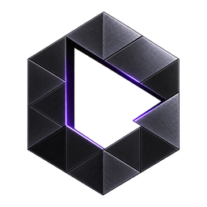

<div align="center">



# Graphite

**Deterministic semantic verification for Solana AI agents.**

Graphite sits between an AI agent's intent and the wallet's execution. It verifies that a constructed transaction actually does what was declared — with a falsifiable confidence score, not a binary safe/unsafe.

[](LICENSE)
[](graphite-core/tests/)
[](graphite-core/)
[](graphite-core/protocols/)
[](graphite-core/src/risk_engine.rs)
[](https://github.com/Stan-lee13/graphite/releases)

</div>

---

## The Problem This Solves

AI agents on Solana can construct and submit transactions autonomously. But nothing verifies that the transaction they *say* they're building is the transaction they *actually* build.

```
WITHOUT GRAPHITE:

  AI Agent → "Swap 1 SOL for USDC" → Construct Transaction → Wallet → Blockchain
                                         ↑
                                    No one checks if the
                                    transaction actually
                                    does what was declared

WITH GRAPHITE:

  AI Agent → "Swap 1 SOL for USDC" → Graphite verifies → Wallet → Blockchain
                                         ↓
                                    8-layer pipeline checks:
                                    • Accounts match the protocol
                                    • Instruction matches the intent
                                    • No drainer patterns
                                    • No authority hijacks
                                    • No hidden transfers
                                    • Confidence score is honest
                                    • Policy threshold is met

                                    If any check fails → BLOCKED. Period.
```

This is not a simulation. This is not advisory. Graphite is a **deterministic verification gate** — if Graphite blocks, the transaction is not submitted.

---

## What Ships Ready to Run

```bash
# Clone
git clone https://github.com/Stan-lee13/graphite.git
cd graphite

# Build the core engine
cd graphite-core
cargo build --release

# Run 1,007 tests — zero setup (1,016 total; 9 network-dependent tests ignored
# unless run explicitly with a live RPC)
cargo test --release

# Output:
# running 1016 tests
# test result: ok. 1007 passed; 0 failed; 9 ignored

# Run the benchmark (16 scored cases + 2 baseline comparisons, P16 compliant)
cargo run --release --bin graphite -- benchmark
```

---

## Architecture — 8-Layer Verification Pipeline

Each layer can only **reduce** confidence or **block**. No layer can invent confidence that lower layers didn't earn.

| Layer | Name | Responsibility | Failure Mode |
|-------|------|---------------|--------------|
| L1 | Account Resolution | Resolve all required accounts/PDAs | Missing/ambiguous → block |
| L2 | Instruction Verification | Confirm discriminator + args match known shape | Unknown → Unknown Protocol Mode |
| L3 | Simulation Verification | Run `simulateTransaction`, confirm it succeeds | Simulation failure → block |
| L4 | State Verification | Diff pre/post account state vs declared intent | Mismatch → block or flag |
| L5 | Semantic Verification | Compare diff against Semantic Graph expectations | Deviation → confidence penalty |
| L6 | Policy Verification | Apply wallet's policy profile thresholds | Policy violation → block |
| L7 | Risk Verification | Run Risk Engine — forbidden patterns, compositional risk | Forbidden pattern → block |
| L8 | Execution Verification | Post-submission: confirm on-chain result matches prediction | Mismatch → audit trail flag |

**Current status:** L1–L7 active. L3 live-validated against real Solana devnet RPC (C40). L8 live-validated against real mainnet RPC — reports honest execution status (Confirmed / Unknown / Unavailable). Both L3 and L8 production default-on wiring shipped; public deployment endpoint pending.

---

## Risk Engine — 11 Attack Patterns (14 Risk Checks)

| Pattern | What It Catches |
|--------|----------------|
| **Drainer** | High account-to-change ratio — multi-transfer drain |
| **AuthorityHijack** | SetAuthority/CloseAccount via CPI from untrusted root |
| **HiddenTransfer** | Transaction touches accounts not in declared state changes |
| **UnexpectedCpi** | CPI target not in manifest's allowed list (fail-closed) |
| **FakeSwap** | Swap intent on a non-swap program |
| **PermissionEscalation** | SPL Token Approve instruction when intent is "transfer" |
| **MaliciousAccountChange** | CloseAccount/Allocate when intent is not "close" |
| **CompositionalDrainPattern** | Deep CPI chains (5+) from untrusted roots, or repeated program revisits |
| **Impersonation** | Fund movement to/from vanity addresses impersonating official system accounts (SolPhishHunter class) |
| **MultiInstructionDrain** | Coordinated mass-drain across multiple instructions in one tx (approve-then-transfer, authority-hijack-then-drain, close-and-sweep, mass multi-transfer sweep) |
| **CpiTraceAnomaly** | Malicious shape in hierarchical CPI trace — unknown program, repeated revisits, or vanity-impersonated program in the tree |

All 11 patterns are real detection logic — not stubs, not placeholders. Nine are emitted by the single-instruction risk engine (`risk_engine.rs`); `MultiInstructionDrain` and `CpiTraceAnomaly` are emitted by the transaction-level and CPI-trace analyzers (`tx_pattern_analysis.rs`) and mapped onto the same `RiskPattern` enum in the orchestrator.

---

## Supported Protocols (33 Manifests / 803 Instructions)

| Protocol | Program ID | Trust Tier |
|----------|-----------|------------|
| System Program | `11111111111111111111111111111111` | Battle Tested |
| SPL Token | `TokenkegQfeZyiNwAJbNbGKPFXCWuBvf9Ss623VQ5DA` | Battle Tested |
| Token-2022 | `TokenzQdBNbLqP5VEhdkAS6EPFLC1PHnBqCXEpPxuEb` | Official Manifest |
| Stake Program | `Stake11111111111111111111111111111111111111` | Battle Tested |
| Memo (v4.0.0, upgradeable) | `Memo4c2pN8afCj432Lb7RMVKi9PbQnnW7ewFFaV3oAH` | Official Manifest |
| Memo (classic SPL, restored 2026-08-08) | `MemoSq4gqABAXKb96qnH8TysNcWxMyWCqXgDLGmfcHr` | Official Manifest |
| Memo (legacy SPL, superseded) | `Memo1UhkJRfHyvLMcVucJwxXeuD728EqVDDwQDxFMNo` | Official Manifest |
| Associated Token Account | `ATokenGPvbdGVxr1b2hvZbsiqW5xWH25efTNsLJA8knL` | Official Manifest |
| Compute Budget | `ComputeBudget111111111111111111111111111111` | Official Manifest |
| BPF Loader (classic) | `BPFLoader2111111111111111111111111111111111` | Official Manifest |
| BPF Loader Upgradeable | `BPFLoaderUpgradeab1e11111111111111111111111` | Official Manifest |
| Jupiter V6 | `JUP6LkbZbjS1jKKwapdHNy74zcZ3tLUZoi5QNyVTaV4` | Battle Tested |
| Orca Whirlpools | `whirLbMiicVdio4qvUfM5KAg6Ct8VwpYzGff3uctyCc` | Battle Tested |
| Meteora DLMM | `LBUZKhRxPF3XUpBCjp4YzTKgLccjZhTSDM9YuVaPwxo` | Battle Tested |
| Raydium AMM V4 | `675kPX9MHTjS2zt1qfr1NYHuzeLXfQM9H24wFSUt1Mp8` | Battle Tested |
| Squads V4 | `SQDS4ep65T869zMMBKyuUq6aD6EgTu8psMjkvj52pCf` | Battle Tested |
| Pump.fun | `6EF8rrecthR5Dkzon8Nwu78hRvfCKubJ14M5uBEwF6P` | Official Manifest |
| Jupiter DCA | `DCA265Vj8a9CEuX1eb1LWRnDT7uK6q1xMipnNyatn23M` | Official Manifest |
| Wormhole Core | `worm2ZoG2kUd4vFXhvjh93UUH596ayRfgQ2MgjNMTth` | Official Manifest |
| Metaplex Token Metadata | `metaqbxxUerdq28cj1RbAWkYQm3ybzjb6a8bt518x1s` | Official Manifest |
| Drift Protocol | `dRiftyHA39MWEi3m9aunc5MzRF1JYuBsbn6VPcn33UH` | Official Manifest |
| Kamino Lending | `KLend2g3cP87fffoy8q1mQqGKjrxjC8boSyAYavgmjD` | Official Manifest |
| Phoenix | `PhoeNiXZ8ByJGLkxNfZRnkUfjvmuYqLR89jjFHGqdXY` | Official Manifest |
| OpenBook V2 | `opnb2LAfJYbRMAHHvqjCwQxanZn7ReEHp1k81EohpZb` | Official Manifest |
| Switchboard | `SW1TCH7qEPTdLsDHRgPuMQjbQxKdH2aBStViMFnt64f` | Official Manifest |
| Jupiter Limit Order | `jupoNjAxXgZ4rjzxzPMP4oxduvQsQtZzyknqvzYNrNu` | Official Manifest |
| Solend | `So1endDq2YkqhipRh3WViPa8hdiSpxWy6z3Z6tMCpAo` | Official Manifest |
| Marginfi | `MFv2hWf31Z9kbCa1snEPYctwafyhdvnV7FZnsebVacA` | Official Manifest |
| Raydium CLMM | `CAMMCzo5YL8w4VFF8KVHrK22GGUsp5VTaW7grrKgrWqK` | Official Manifest |
| Raydium CPMM | `CPMMoo8L3F4NbTegBCKVNunggL7H1ZpdTHKxQB5qKP1C` | Official Manifest |
| Marinade Staking | `MarBmsSgKXdrN1egZf5sqe1TMai9K1rChYNDJgjq7aD` | Official Manifest |
| SPL Stake Pool | `SPoo1Ku8WFXoNDMHPsrGSTSG1Y47rzgn41SLUNakuHy` | Official Manifest |
| Orca TokenSwap V2 | `9W959DqEETiGZocYWCQPaJ6sBmUzgfxXfqGeTEdp3aQP` | Official Manifest |

---

## What's in the Box

```
graphite/
│
├── graphite-core/                  ← Rust verification engine (the heart)
│   ├── src/
│   │   ├── verification.rs         ← 8-layer pipeline orchestrator
│   │   ├── account_resolution.rs  ← L1: PDA derivation (Solana hash-chain), account matching
│   │   ├── risk_engine.rs         ← L7: 11 attack pattern detectors (14 checks)
│   │   ├── confidence_engine.rs   ← L6: Weighted signal scoring + tier ceilings
│   │   ├── policy_engine.rs       ← L6: Per-wallet policy profiles
│   │   ├── simulation_integrity.rs← L3: 3-signal z-score (compute/writes/CPI) + MAD baseline
│   │   ├── semantic_graph_store.rs← L5: Trust tier computation, append-only storage
│   │   ├── transaction_builder.rs ← Canonical serialization, compute budget estimate
│   │   ├── unknown_protocol_mode.rs← 0.55 confidence cap (P6/P12)
│   │   ├── tx_pattern_analysis.rs ← Multi-instruction drain + CPI trace analysis (C29)
│   │   ├── manifest.rs            ← Protocol manifest loading + registry
│   │   ├── manifest_registry.rs   ← Signed community manifest submissions (G5/P7/P10/P11)
│   │   ├── regression_engine.rs   ← P10 promotion gate + fixture corpus replay
│   │   ├── plugin_orchestrator.rs ← P8 plugin framework (sole plugin caller)
│   │   ├── plugins/               ← Built-in: FakeRewardsDrainer (L7), EventLogger (analytics)
│   │   ├── live_corpus.rs         ← Live RPC fixture seeding + devnet verification
│   │   ├── rpc_client.rs          ← Solana RPC client (L3 simulation + L8 execution)
│   │   ├── durable.rs             ← Snapshot persistence + restart recovery
│   │   ├── solana_types.rs        ← PDA derivation, base58, type primitives
│   │   ├── server.rs              ← HTTP API (axum): /verify, /manifests, /health, /api/*
│   │   ├── benchmark.rs           ← P16-compliant benchmark (16 scored + 2 baselines)
│   │   ├── bin/graphite.rs        ← Binary entry point (server + CLI)
│   │   └── cli.rs                 ← CLI (clap): verify, benchmark, regression, registry
│   ├── protocols/                 ← 33 JSON protocol manifests (803 instructions)
│   └── tests/                     ← 1,007 tests (unit + adversarial + exploit + live RPC)
│
├── dashboard/                     ← React + TS dashboard (5 views, polls /api/*)
│
├── sdk/
│   ├── typescript/                ← TS SDK (GraphiteClient + AuditBind middleware)
│   └── go/                        ← Go SDK (19-field VerificationResult parity)
│
├── integrations/
│   └── solana-agent-kit/          ← SAK v2 integration (verified execution gate)
│       ├── graphite-sak-bridge.ts ← Pre-flight Graphite verification before SAK executes
│       ├── auditbind.ts           ← TOCTOU prevention: re-hash signed tx vs approved content_hash
│       ├── demo.ts               ← End-to-end demo
│       ├── devnet-test.ts         ← Live devnet test suite (5 finalized txs)
│       └── mainnet-benchmark.ts   ← Real mainnet exploit benchmark runner
│
├── python-ai-layer/               ← Advisory intent parser (P1: AI never decides)
│   ├── intent_parser.py
│   └── test_intent_parser.py
│
├── examples/                      ← Sample verification inputs/outputs
├── schemas/                       ← JSON schemas (proposed-intent, verification-result)
├── docs/                          ← Audit reports, certification, grant proposal
├── .github/                       ← CI workflow + issue/PR templates
│
├── ARCHITECTURE.md                ← System design specification
├── ROADMAP.md                     ← Phase 1 (done) → Phase 2 (in progress) → Phase 3+
├── SECURITY.md                    ← Security policy + known limitations
├── CONTRIBUTING.md                 ← How to contribute
├── GRAPHITE_FINAL_CERTIFICATION_REPORT.md ← Phase 2 certification
├── Dockerfile                     ← Multi-stage container build
├── docker-compose.yml             ← One-command deploy
└── README.md                      ← You are here
```
---

## Quick Start

### 1. Run the verification engine

```bash
cd graphite-core
cargo run --release --bin graphite -- server --port 7331
# Graphite Core running on port 7331
```

### Production server configuration (all optional env vars)

| Env var | Default | Purpose |
|---------|---------|---------|
| `GRAPHITE_API_KEY` | *(unset = open)* | **Set this in production.** Bearer token required on `/verify` and `/manifests` (constant-time compared). `/health` stays open for load balancers. |
| `GRAPHITE_RATE_LIMIT` | `30` | Per-IP token bucket, requests/second. Returns `429` when exceeded. |
| `GRAPHITE_CORS_ORIGINS` | *(denied)* | Comma-separated allowed browser origins. Default denies all cross-origin browser calls; server-to-server clients are unaffected. |
| `GRAPHITE_DATA_DIR` | `./graphite-data` | Durability: semantic-graph snapshot (trust tiers + earned simulation baselines) and append-only `audit.jsonl` written after every verification, reloaded on restart. |
| `GRAPHITE_RPC_URL` | *(off)* | Attaches a Solana RPC client — live L3: `simulateTransaction` runs and real compute usage feeds the trusted baseline accumulator. |

```bash
# Minimal production launch (auth + rate limit + durability)
GRAPHITE_API_KEY=$(openssl rand -hex 32) GRAPHITE_RATE_LIMIT=100 \
  GRAPHITE_DATA_DIR=/var/lib/graphite GRAPHITE_CORS_ORIGINS= \
  cargo run --release --bin graphite -- server --port 7331
```

### 2. Verify a transaction

```bash
curl -X POST http://localhost:7331/verify \
  -H "Content-Type: application/json" \
  -d @../examples/verify-input.json | jq .
```
> ⚠️ The example input uses the `TradingBot` profile (0.80 threshold). On a fresh Core (no earned evidence) the achievable confidence for a known protocol is ~0.44, so this example returns **BLOCKED** — that is the engine being honest, not a bug. The confidence signals are *earned*, not asserted: `SimulationMatch`, `HistoricalVolume`, and `CommunityVerification` read from the Semantic Graph's internal accumulator (RPC-verified baselines and Behavior evidence), so the presets become satisfiable as the graph accumulates verified history. To see an immediate approval on a fresh core, set a calibrated profile:
> 
> ```bash
> jq '.wallet_profile = {"Custom": {"min_confidence": 0.40, "min_trust_tier": "OfficialManifest"}}' ../examples/verify-input.json | curl -X POST http://localhost:7331/verify -H "Content-Type: application/json" -d @- | jq .approved
> ```

### 3. Run the SAK integration demo

```bash
# Start AI Layer (separate process, P1 compliance)
cd python-ai-layer
python3 intent_parser.py --serve --port 8081

# Run the demo
cd ../integrations/solana-agent-kit
npx tsx demo.ts "Swap 0.5 SOL for USDC"
```

The demo shows the full flow:
1. AI Layer parses "Swap 0.5 SOL for USDC" → `ProposedIntent`
2. SAK constructs the Jupiter V6 swap transaction
3. Graphite verifies the transaction → `VerificationResult`
4. If approved → SAK executes. If blocked → transaction is NOT submitted.

---

## Dashboard

The read-only dashboard (`dashboard/`) visualizes live Core state — protocol
overview with trust tiers, a Semantic Graph view with directed CPI edges, a
confidence time series, policy violations, and the Manifest Registry.

```bash
cd dashboard
npm install
npm run dev          # dev: proxies /api to http://localhost:7331
npm run build        # production build → dist/
```

It polls the read-only endpoints (`/api/graph`, `/api/confidence-history`,
`/api/policy-violations`, `/api/protocols/top`, `/api/registry`) that the
Core server exposes behind the same Bearer auth and rate limiting as
`/verify`. Point a browser at the dev server (or serve `dist/` statically)
and set `VITE_GRAPHITE_API` if Core lives elsewhere. Read-only by
construction (Constitution P4) — the dashboard never mutates graph state.

## Security Properties

| Property | How It's Enforced |
|----------|-------------------|
| **Unknown protocol cap** | Hard 0.55 confidence ceiling — no caller evidence can override (P6/P12) |
| **Fail-closed on unknown** | Unknown discriminator on known protocol → BLOCKED (confidence 0.0) |
| **NaN bypass prevention** | Explicit NaN/Infinity rejection in confidence engine |
| **AI never decides** | Python AI layer is advisory only — Core verification is deterministic (P1) |
| **Deterministic** | `content_hash` = SHA-256 of transaction config — same input, same output (P2) |
| **Compositional drain detection** | Both duplicate AND unique-program deep CPI chains caught |
| **Trusted simulation baselines** | Baselines live in the semantic-graph accumulator (earned via RPC-verified usage or operator-seeded) — the request body **cannot** supply one (anti-poisoning) |
| **API auth** | Optional Bearer API key, constant-time compared; `429` per-IP rate limiting; CORS allowlist (denied by default) |
| **Durability** | Semantic-graph snapshot + append-only audit trail (`audit.jsonl`) persisted to `GRAPHITE_DATA_DIR`, reloaded on restart |

---

## Honest Status

What we **do not** claim:

- The benchmark is 18 scored cases (safe + malicious) plus 2 baseline comparisons — NOT a statistical evaluation on unseen data. "100% precision / 100% recall on the scored benchmark cases" is the honest claim. Composition (C52): 5 REAL mainnet exploit cases (STMT drainer 64tsGGe, AAT drainer 524t8LW, Wormhole $320M hack 5fKWY7X, fresh Aug-2026 drainer chain 2AWwL6dk, AAT mass drain 3PbK87 — pinned from `tests/real_onchain_exploits.rs` + `scripts/real_exploit_*.json`, reproducible offline) + 2 SYNTHETIC drainer cases, honestly labeled. Avg latency ~2.1ms with the real-data cases (release build); the earlier sub-ms figure predates them.
- 2 exploit reconstructions use real program IDs but fabricated account structures. They are labeled "SYNTHETIC" per P16, not "real mainnet data." The other 5 exploit cases are REAL mainnet data (Wormhole $320M, CLINKSINK STMT drainer, SlowMist AAT drainer, fresh drainer chain, AAT mass drain).
- L3 (Simulation) is active when an RPC client is attached and was verified against real Solana devnet transactions (Aug 7, 2026). L8 (Execution Verification) was live-validated against real mainnet RPC (C40) and reports honest execution status — Confirmed / Unknown / Unavailable. Production default-on wiring for both remains pending public deployment.
- No LLM-based intent parsing in the verification path (P1: AI assists, never decides). Intent alignment is structural — the declared intent type is matched against the manifest's supported intents (L5, Check 9), and high-risk instruction classes with no declared intent fail closed (Check 10, C38).

What we **do** claim:

- **Confidence is calibrated honestly and earned, never asserted (G4).** The three evidence-derived signals (`SimulationMatch`, `HistoricalVolume`, `CommunityVerification`) read from the Semantic Graph's **internal accumulator** — the program's RPC-verified simulation baseline (`sample_count`) and its earned Behavior evidence — never from request-body JSON, which an attacker could fabricate to mint confidence. Trust tiers are capped at `OfficialManifest` (P7: tiers 3+ must be earned via the Semantic Graph, not self-asserted). A fresh Core therefore scores a known, clean, intent-aligned protocol at **~0.44** and the built-in presets (TradingBot 0.80, Treasury 0.95, Gaming 0.55, Enterprise 0.99) block everything until evidence is earned — e.g. Gaming (0.55) is exactly satisfiable by a HeuristicInferred manifest-backed program (the P6 ceiling), Treasury unlocks at battle-tested evidence (≈ 0.98). The benchmark and SAK demo default to a `Custom { min_confidence: 0.40, min_trust_tier: OfficialManifest }` profile; `graphite verify --profile <preset>` or `graphite profiles` drives the presets from the CLI. Raise or lower the profile to change policy; the engine's score itself is the honest number.
- 1,007 Rust tests passing (1,016 running; 9 network-dependent ignored), 0 failures, 0 clippy warnings — every test has real assertions.
- 14 risk checks (11 risk patterns) are real detection logic, not stubs. Multi-instruction drain, CPI trace analysis (C29), and manifest-declared high-risk class gating (C38) shipped.
- 33 protocol manifests / 803 instructions, program IDs verified against official on-chain sources (2026-08-07 + Drift/Kamino C27/C42 + Phoenix/OpenBook V2/Switchboard/Jupiter Limit/Solend/Marginfi C46 + Raydium CLMM/CPMM, Marinade, SPL Stake Pool, Orca TokenSwap V2 C56).
- Confidence engine uses real weighted computation with tier ceilings and NaN rejection.
- Simulation integrity uses 3-signal z-score (compute, writes, CPI hops) with Welford's algorithm and median/MAD baseline (C28).
- The SAK integration imports real `solana-agent-kit` v2 and calls real SAK methods — **verified on Solana devnet** (wallet `CWb8MciizembLV66kisYcXo3Cb91hdszxw74QHpEJKZR`, 5 finalized transactions: 2 faucet airdrops + 3 SAK test transfers; latest signature `xHa4dyuFS6JmSaTsmhcMpEtwbWnPjBoUGwk3wNixD2uw2Wmeui6GhnSmmdzNVkv85zXSd6g7QYhHymAjciwP3jJ` confirmed and finalized).
- 2,747-fixture regression corpus (C41 + C52): dev 2,676 + regression 31 + holdout 40 (37 real mainnet exploit signatures — 35 SolPhishHunter + 2 live-fetched from mainnet RPC — + 3 real mainnet txs), independently labeled, 0 false negatives.

---

## Documentation

| Document | Description |
|----------|-------------|
| [ARCHITECTURE.md](ARCHITECTURE.md) | System design, 8-layer pipeline, subsystem specs |
| [ROADMAP.md](ROADMAP.md) | Phase 1 (done) → Phase 2 (in progress) → Phase 3+ |
| [SECURITY.md](SECURITY.md) | Security policy, known limitations, reporting |
| [CONTRIBUTING.md](CONTRIBUTING.md) | Development setup, PR checklist, Constitution principles |
| [Engineering Skill](https://github.com/Stan-lee13/graphite-engineering-skill) | The skill that builds Graphite — Constitution, personas, checklists |

---

## License

MIT — Copyright (c) 2026 Victor Stanley

---

<div align="center">

*If an AI agent is going to submit transactions on your behalf, something should verify those transactions first. That's what Graphite does.*

</div>
